<p align="center">
  
  
  
  
  
  
</p>

<h1 align="center" style="margin: 30px 0 30px; font-weight: bold;">Campus Life</h1>

<p align="center">
  <b>基于 Spring Boot + Spring Cloud Gateway + Vue 3 + Spring AI 的校园生活全栈项目</b>
</p>

<p align="center">
  <i>覆盖校园社区、商家优惠券、订单支付、消息通知、后台管理、AI 智能体、大模型网关和知识库检索等核心业务。</i>
</p>

> **声明**
>
> 项目中的第三方服务、测试数据、素材和部署配置需要根据实际使用场景自行替换，并确保合法合规。

---

## 项目链接

49.232.59.230

## 项目简介

Campus Life 是一个前后端分离的校园生活服务平台，包含用户端、商家端、管理端、主业务后端、AI 服务和 API 网关。

平台围绕校园内容社区和本地生活业务展开，提供内容发布、评论互动、优惠券领取、订单支付、退款处理、消息通知、后台审核、AI 对话和知识库问答等能力。

### 项目展示

| 展示图 | 展示图 |
| --- | --- |
| 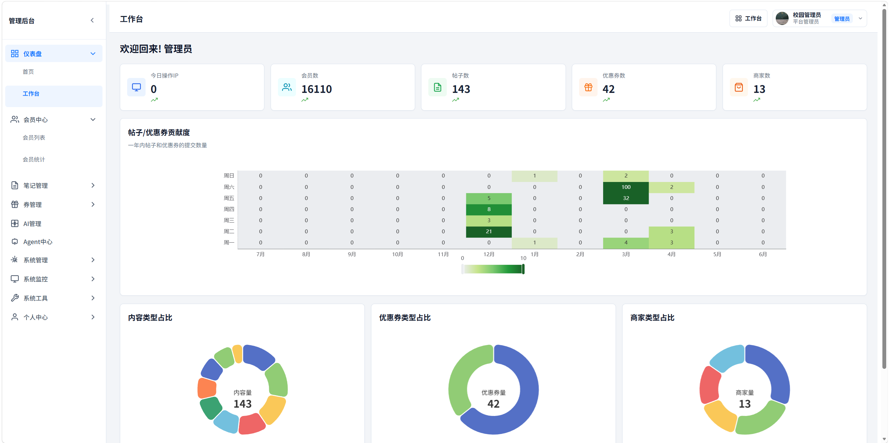 | 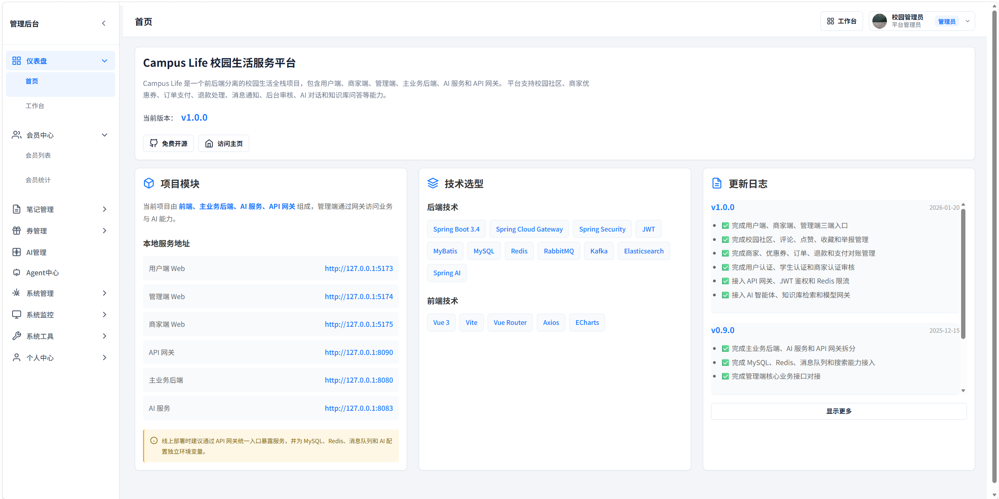 |
| 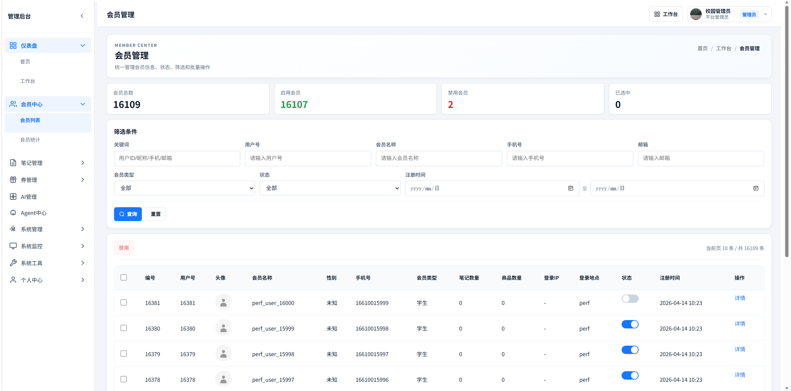 | 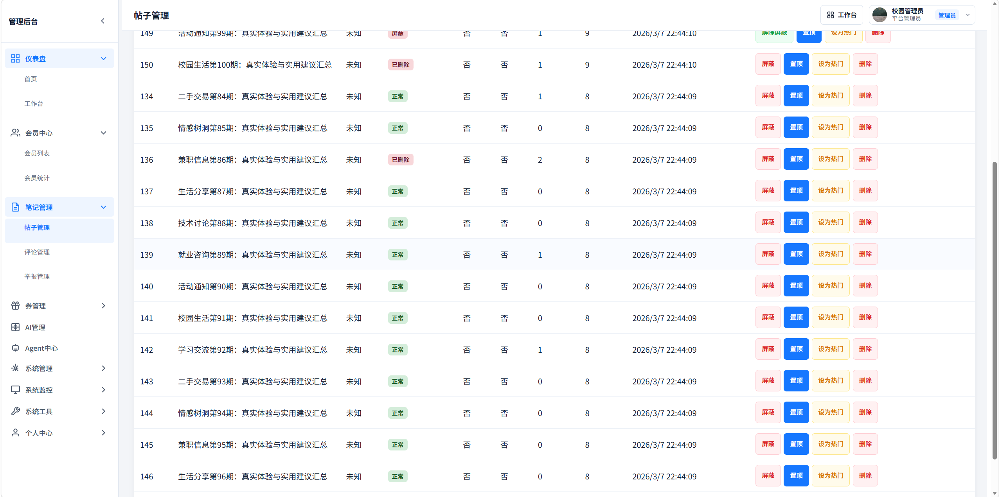 |
| 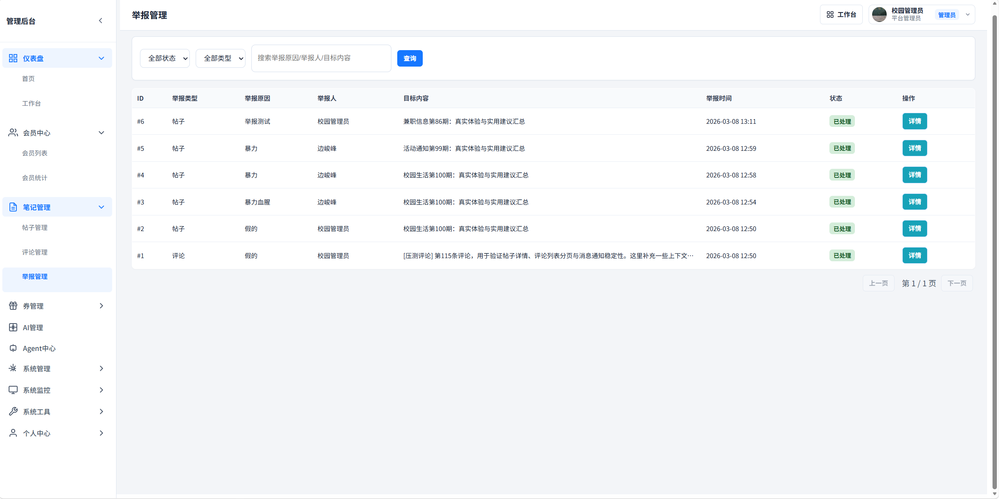 | 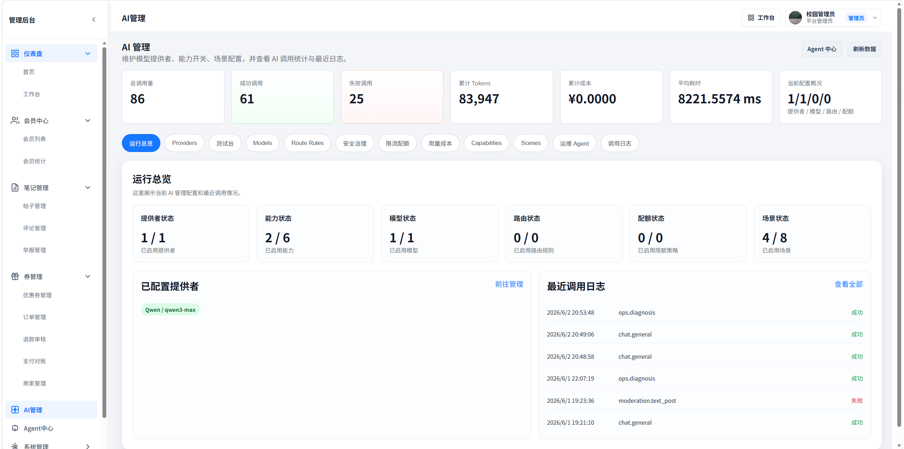 |
| 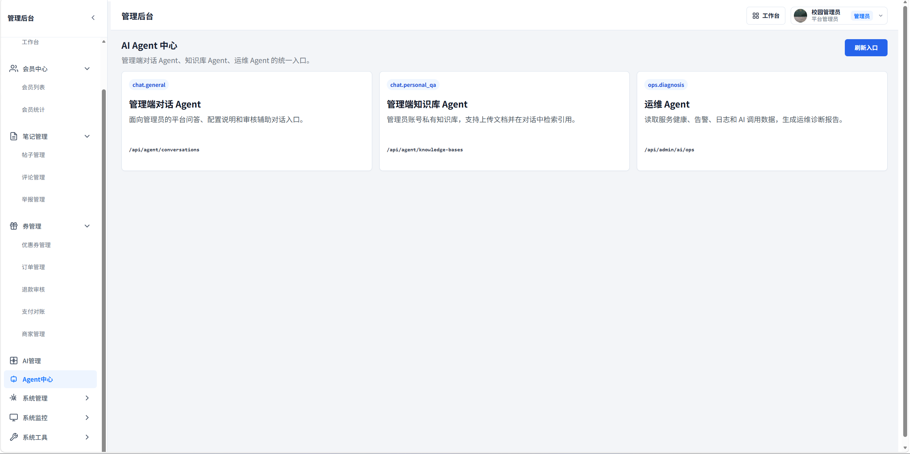 | 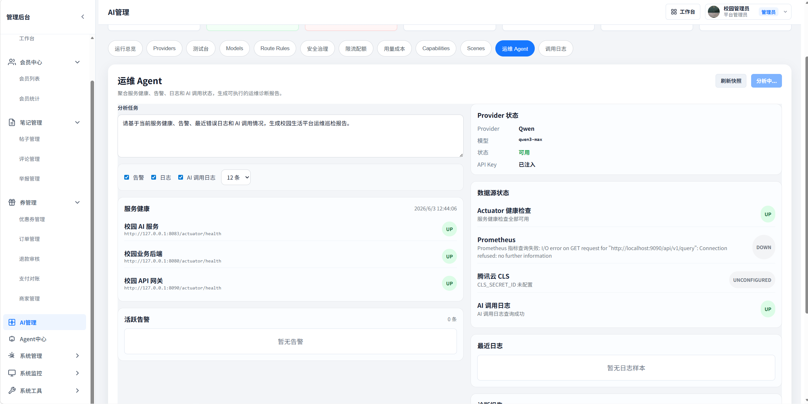 |
| 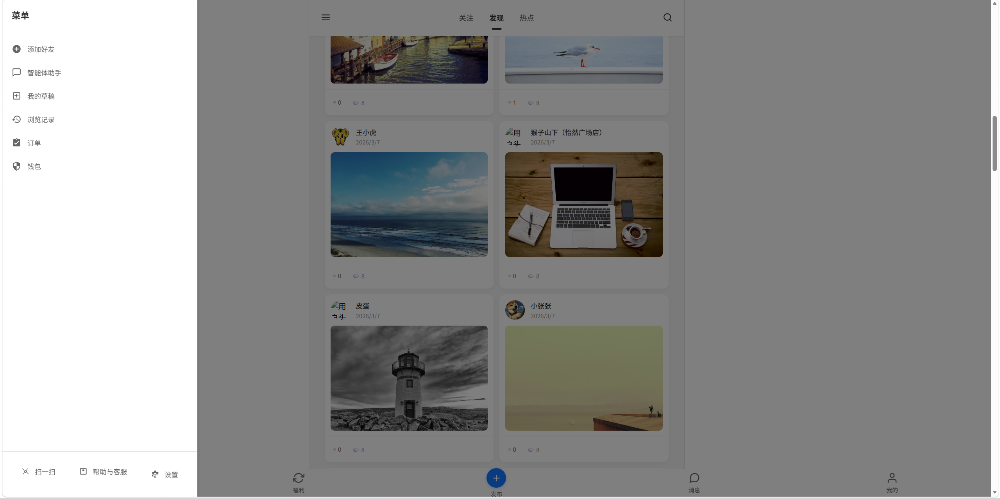 | 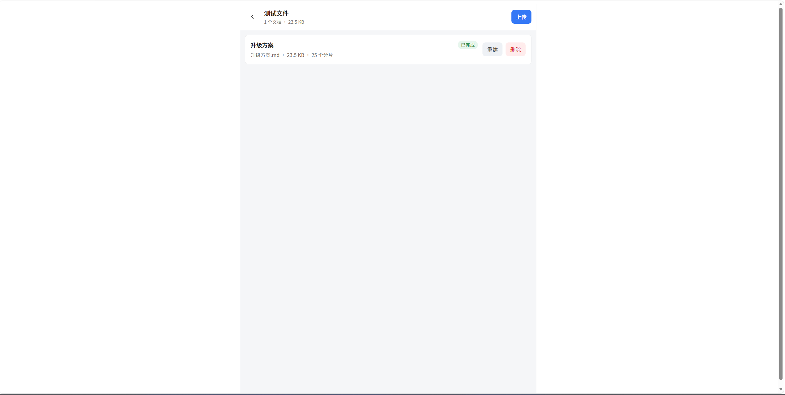 |
| 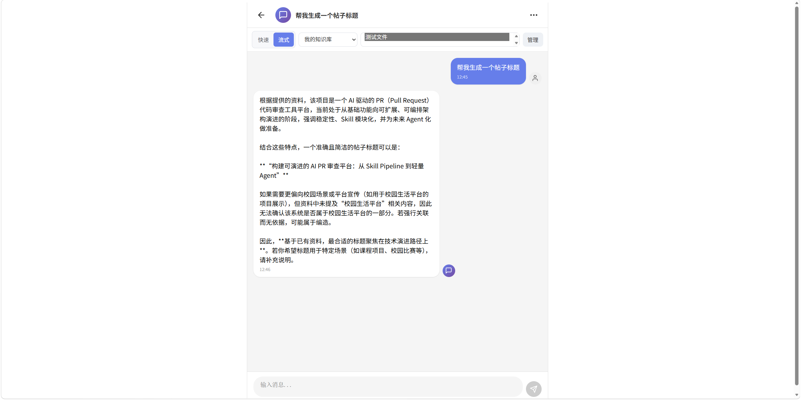 | 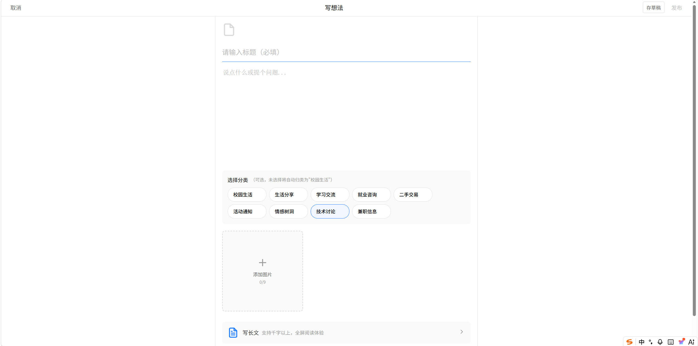 |
| 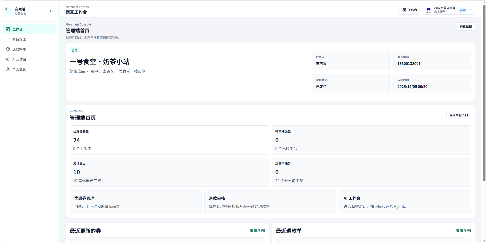 |  |

### 项目组成

| 模块 | 模块说明 | 技术栈 | 默认端口 |
| --- | --- | --- | --- |
| **campus-life-frontend** | 用户端、商家端、管理端前端代码 | Vue 3、Vite、Vue Router、Axios、ECharts | `5173`、`5175`、`5174` |
| **campus-life-backend** | 主业务后端服务 | Spring Boot、Spring Security、MyBatis、MySQL、Redis、RabbitMQ、Kafka、Elasticsearch | `8080` |
| **campus-life-ai** | AI 微服务 | Spring Boot、Spring AI、MyBatis、MySQL、Milvus、OpenAI 兼容接口 | `8083` |
| **campus-life-gateway** | API 网关服务 | Spring Cloud Gateway、Redis RateLimiter、JWT、Micrometer | `8090` |
| **deploy/docker** | **L1/L2 全栈 Docker 部署** | Docker Compose、Nginx、MySQL、Redis、RabbitMQ | `80`（可改 `HTTP_PORT`） |
| **deploy/middleware** | 本地开发中间件 | 仅 MySQL、Redis、RabbitMQ | `3307`、`6379`、`5672` |
| **deploy/demo** | 裸机示例部署 | systemd、Nginx | - |
| **docs** | 架构与模块设计文档 | Markdown | - |
| **perf** | 压测脚本和报告 | JMeter、测试结果报告 | - |

### 技术选型

<table>
<tr>
<td width="33%">

#### 后端技术栈

- **基础框架**：Spring Boot 3.4
- **网关**：Spring Cloud Gateway
- **安全认证**：Spring Security、JWT
- **数据库**：MySQL、MyBatis
- **缓存**：Redis、Caffeine
- **消息队列**：RabbitMQ、Kafka
- **搜索**：Elasticsearch
- **限流保护**：Sentinel、Gateway RateLimiter
- **接口文档**：SpringDoc OpenAPI
- **监控指标**：Actuator、Micrometer、Prometheus

</td>
<td width="33%">

#### 前端技术栈

- **框架**：Vue 3
- **构建工具**：Vite
- **路由**：Vue Router
- **请求库**：Axios
- **图表**：ECharts、vue-echarts
- **入口**：用户端、商家端、管理端
- **运行模式**：H5/Web
- **构建产物**：consumer-web、merchant-web、admin-web

</td>
<td width="33%">

#### AI 与基础设施

- **AI 框架**：Spring AI
- **模型接口**：OpenAI 兼容协议
- **模型网关**：供应商、模型、路由、配额、安全策略
- **知识库**：文件上传、分块、检索
- **向量存储**：Milvus
- **对象存储**：MinIO、OSS 可配置
- **容器化**：Docker、Docker Compose
- **反向代理**：Nginx

</td>
</tr>
</table>

---

## 项目特色

| 功能模块 | 技术实现 | 说明 |
| --- | --- | --- |
| 统一 API 网关 | Spring Cloud Gateway + JWT + Redis RateLimiter | 前端请求统一入口，集中处理鉴权、限流、白名单和路由 |
| 校园社区 | Spring Boot + MyBatis + Redis | 支持帖子、评论、点赞、收藏、关注、举报和内容审核 |
| 商家优惠券 | Redis + RabbitMQ + Sentinel + Caffeine | 支持优惠券管理、秒杀券、购物车、下单和异步队列处理 |
| 订单支付 | 订单状态机 + 支付回调 + 幂等处理 | 支持钱包支付、支付宝配置、退款、对账和订单状态同步 |
| 搜索能力 | MySQL 兜底 + Elasticsearch 增强 + Kafka 同步 | 支持帖子和用户搜索，具备索引同步与补偿机制 |
| 消息通知 | 消息表 + Kafka 可选同步 | 支持聊天、点赞、评论、关注和系统通知 |
| 后台管理 | Vue 管理端 + 后端管理接口 | 覆盖用户、商家、内容、订单、退款、支付、日志和缓存管理 |
| AI 智能体 | Spring AI + OpenAI 兼容模型 | 支持 Agent 对话、商家 AI、后台 AI 配置和服务探测 |
| 大模型网关 | 供应商管理 + 路由规则 + 健康探测 + 配额控制 | 统一封装模型调用，支持模型路由、安全策略和成本控制 |
| 知识库检索 | MySQL 分块存储 + Milvus 向量检索 | 支持知识库文件上传、分块持久化、向量检索和关键词兜底 |

---

## 系统架构

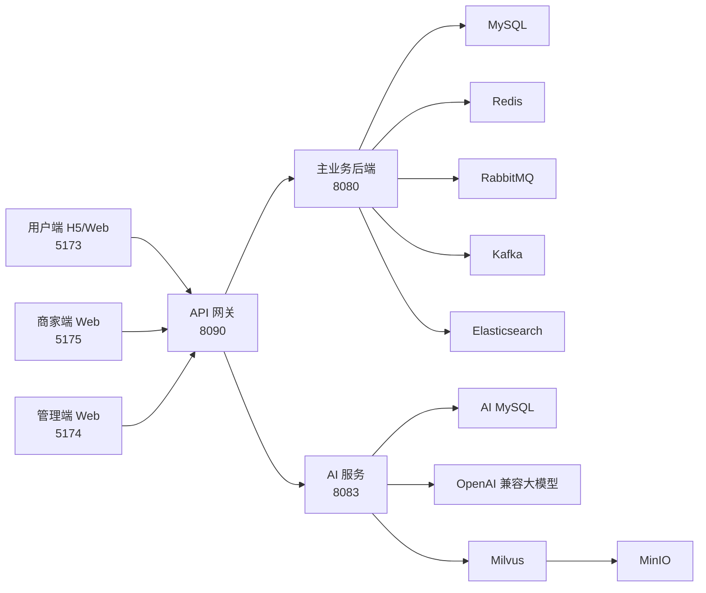

---

## 本地演示

| 端类型 | 访问方式 | 功能说明 |
| --- | --- | --- |
| **用户端** | `http://127.0.0.1:5173/` | 内容浏览、帖子互动、优惠券、订单、钱包、消息、AI 对话 |
| **管理端** | `http://127.0.0.1:5174/` | 用户、内容、商家、订单、退款、支付、日志、AI 配置管理 |
| **商家端** | `http://127.0.0.1:5175/` | 商家首页、优惠券管理、订单处理、退款审核、商家 AI |
| **API 网关** | `http://127.0.0.1:8090/actuator/health` | 网关健康检查 |
| **主业务后端** | `http://127.0.0.1:8080/actuator/health` | 后端健康检查 |
| **AI 服务** | `http://127.0.0.1:8083/actuator/health` | AI 服务健康检查 |
| **Elasticsearch** | `http://127.0.0.1:9200/` | 搜索服务 |
| **Milvus Attu** | `http://127.0.0.1:8000/` | Milvus 管理台 |
| **RabbitMQ 管理台** | `http://127.0.0.1:15672/` | RabbitMQ 管理台 |

---

## 环境要求

| 环境 | 版本建议 | 说明 |
| --- | --- | --- |
| JDK | 17+ | 后端、AI 服务、网关运行环境 |
| Maven | 3.9+ | Java 项目构建工具 |
| Node.js | 18+ | 前端运行环境 |
| npm | 9+ | 前端依赖管理 |
| MySQL | 8+ | 业务数据库 |
| Redis | 6+ | 缓存、限流、业务状态 |
| Docker Desktop | 最新稳定版 | 本地中间件运行，推荐安装 |

可选中间件：

| 中间件 | 用途 |
| --- | --- |
| RabbitMQ | 秒杀和异步订单队列 |
| Kafka | 事件同步、搜索索引同步、通知同步 |
| Elasticsearch | 搜索增强 |
| Milvus / MinIO | AI 知识库向量检索 |

---

## 快速启动

### 启动中间件

```powershell
powershell -ExecutionPolicy Bypass -File .\restart-local-middleware.ps1 -UseDockerCompose
```

仅查看中间件端口状态：

```powershell
powershell -ExecutionPolicy Bypass -File .\restart-local-middleware.ps1 -StatusOnly
```

也可以使用 Docker Compose 仅启动本地中间件：

```powershell
docker compose -f .\deploy\middleware\docker-compose.yml up -d
```

云服务器 **全栈一键部署（L1 演示 / L2 含 Kafka+ES+Milvus）** 见 [`deploy/docker/README.md`](deploy/docker/README.md)。

### 启动项目服务

```powershell
powershell -ExecutionPolicy Bypass -File .\restart-campus-life.ps1
```

该脚本会启动：

- 用户端：`http://127.0.0.1:5173/`
- 管理端：`http://127.0.0.1:5174/`
- 商家端：`http://127.0.0.1:5175/`
- 主业务后端：`http://127.0.0.1:8080/actuator/health`
- AI 服务：`http://127.0.0.1:8083/actuator/health`
- API 网关：`http://127.0.0.1:8090/actuator/health`

---

## 手动启动

### 前端

```powershell
cd campus-life-frontend
npm install
npm run dev:consumer
npm run dev:admin
npm run dev:merchant
```

### 主业务后端

```powershell
cd campus-life-backend
mvn -Dspring-boot.run.profiles=dev spring-boot:run
```

### AI 服务

```powershell
cd campus-life-ai
powershell -ExecutionPolicy Bypass -File .\scripts\start-ai-env.ps1
```

### API 网关

```powershell
cd campus-life-gateway
mvn spring-boot:run
```

---

## 构建与测试

### 前端构建

```powershell
cd campus-life-frontend
npm run build
```

构建产物：

- `dist/consumer-web`
- `dist/merchant-web`
- `dist/admin-web`

### Java 服务构建

```powershell
cd campus-life-backend
mvn clean package
```

```powershell
cd campus-life-ai
mvn clean package
```

```powershell
cd campus-life-gateway
mvn clean package
```

### 单元测试

```powershell
cd campus-life-backend
mvn test
```

```powershell
cd campus-life-ai
mvn test
```

```powershell
cd campus-life-gateway
mvn test
```

---

## 配置说明

项目中的真实密钥、密码、私钥、Token 和 API Key 不应提交到仓库。建议通过环境变量、本地 `.env` 文件或部署平台密钥管理能力注入。

常用环境变量：

| 变量 | 说明 |
| --- | --- |
| `SPRING_DATASOURCE_URL` | 数据库连接地址 |
| `SPRING_DATASOURCE_USERNAME` | 数据库用户名 |
| `SPRING_DATASOURCE_PASSWORD` | 数据库密码 |
| `SPRING_REDIS_HOST` | Redis 地址 |
| `SPRING_REDIS_PORT` | Redis 端口 |
| `SPRING_REDIS_PASSWORD` | Redis 密码 |
| `SPRING_RABBITMQ_HOST` | RabbitMQ 地址 |
| `SPRING_RABBITMQ_PORT` | RabbitMQ 端口 |
| `SPRING_RABBITMQ_USERNAME` | RabbitMQ 用户名 |
| `SPRING_RABBITMQ_PASSWORD` | RabbitMQ 密码 |
| `KAFKA_BOOTSTRAP_SERVERS` | Kafka 地址 |
| `ES_URIS` | Elasticsearch 地址 |
| `JWT_SECRET` | JWT 签名密钥 |
| `OSS_ACCESS_KEY_ID` | OSS AccessKey ID |
| `OSS_ACCESS_KEY_SECRET` | OSS AccessKey Secret |
| `ALIPAY_APP_ID` | 支付宝应用 ID |
| `ALIPAY_PRIVATE_KEY` | 支付宝应用私钥 |
| `ALIPAY_PUBLIC_KEY` | 支付宝公钥 |
| `AI_OPENAI_COMPATIBLE_BASE_URL` | OpenAI 兼容模型接口地址 |
| `AI_OPENAI_COMPATIBLE_API_KEY` | 大模型 API Key |
| `AI_OPENAI_COMPATIBLE_MODEL` | 默认模型 |
| `MILVUS_URI` | Milvus 地址 |
| `MILVUS_TOKEN` | Milvus Token |

示例配置：

- `deploy/demo/.env.example`
- `deploy/demo/backend/application-demo.yml`
- `deploy/demo/ai/application-demo.yml`
- `deploy/demo/gateway/application.yml`

---

## API 路由

| 路径 | 目标服务 |
| --- | --- |
| `/api/agent/**` | AI 服务 |
| `/api/ai/**` | AI 服务 |
| `/api/admin/ai/**` | AI 服务 |
| `/api/merchant/ai/**` | AI 服务 |
| `/api/**` | 主业务后端 |
| `/uploads/**` | 主业务后端 |

---

## 项目文档

| 文档 | 说明 |
| --- | --- |
| `campus-life-frontend/README.md` | 前端项目说明 |
| `campus-life-backend/README.md` | 主业务后端说明 |
| `campus-life-ai/README.md` | AI 服务说明 |
| `campus-life-gateway/README.md` | 网关服务说明 |
| `deploy/demo/README.md` | 示例部署说明 |
| `deploy/demo/DEPLOY_CN.md` | 中文部署文档 |
| `docs/技术架构文档.md` | 技术架构说明 |
| `docs/微服务架构_DDD转型可行性分析.md` | 架构演进分析 |

---

## 仓库规范

提交前请确认以下内容未被提交：

- `target/`
- `node_modules/`
- `dist/`
- `logs/`
- `uploads/`
- `.env`
- 本地运行日志
- 数据库导出文件
- 真实密钥、密码、Token、支付私钥和 API Key

常用提交命令：

```powershell
git status
git add -A
git commit -m "docs: update readme"
```

---

## License

本项目基于 MIT License 开源，详见 [LICENSE](./LICENSE)。
