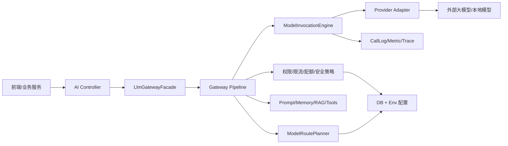
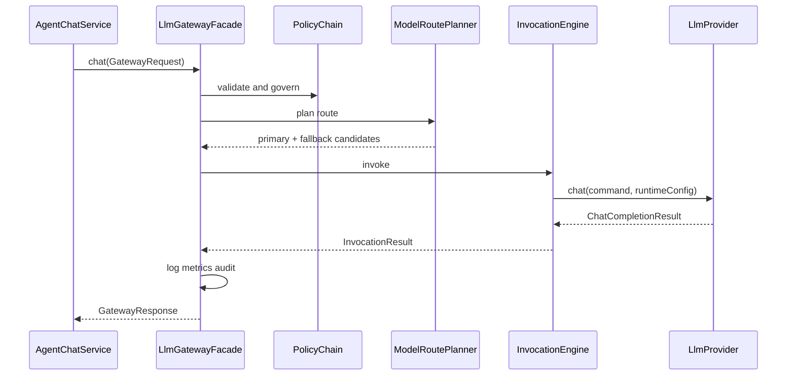

# 大模型网关框架设计

本文档面向 `campus-life-ai` 模块，目标是在现有 AI 微服务内建设统一的大模型网关层，承接多供应商、多模型、多场景、多调用形态的治理能力。

## 设计目标

- 统一入口：业务侧只按 `capabilityCode`、`sceneCode`、`modelCode` 调用，不直接感知供应商 API。
- 统一路由：基于数据库配置、场景策略、灰度规则、健康状态和成本偏好选择模型。
- 统一治理：限流、配额、超时、重试、降级、内容安全、审计、调用日志统一处理。
- 统一协议：屏蔽 OpenAI Compatible、Spring AI、后续私有模型或本地模型的协议差异。
- 统一观测：所有模型调用都能按请求、用户、场景、供应商、模型统计成功率、延迟、Token、错误和成本。

## 当前基础

当前项目已具备可复用基础：

- `ai_provider_config`：供应商、Base URL、密钥密文、默认模型和超时配置。
- `ai_capability_config`：能力开关、灰度、限流和配额预留字段。
- `ai_scene_config`：场景到供应商和模型的默认映射。
- `ai_call_log`：调用审计和运维统计基础。
- `LlmProvider`、`ProviderSelector`：供应商适配抽象。
- `AiChatRouteResolver`：聊天场景路由解析。
- `AgentChatService`：同步、SSE 流式、知识库检索、工具调用、会话记忆和落库。
- `KnowledgeSearchService`、`AgentToolRegistry`：RAG 和工具调用接入点。

因此建议采用“AI 微服务内部网关层”方案，在现有包结构上新增 `ai.gateway` 领域，不拆独立服务。

## 总体架构



核心思路是将“业务编排”和“模型调用治理”拆开。`AgentChatService` 继续负责会话、消息、知识库和响应组装；真正调用模型前统一构造 `GatewayRequest`，交给 `LlmGatewayFacade` 完成策略、路由、调用、观测和异常归一化。

## 分层设计

### 1. API 层

保留现有接口：

- `/api/agent/conversations/{sessionId}/messages`
- `/api/agent/conversations/{sessionId}/messages/stream`
- `/api/admin/ai/providers`
- `/api/admin/ai/capabilities`
- `/api/admin/ai/scenes`

后续新增内部统一调用接口时，建议只面向可信业务服务开放：

- `POST /api/internal/ai/gateway/chat`
- `POST /api/internal/ai/gateway/chat/stream`
- `POST /api/internal/ai/gateway/embedding`
- `POST /api/internal/ai/gateway/moderation`

外部用户侧仍走 Agent 接口，避免把网关策略参数暴露给普通客户端。

### 2. Gateway Facade 层

建议新增包：

```text
com.campus.campus_life_ai.ai.gateway
  LlmGatewayFacade
  GatewayRequest
  GatewayResponse
  GatewayStreamResponse
  GatewayUsage
  GatewayErrorCode
```

职责：

- 接收统一请求。
- 生成 `requestId` 并贯穿日志。
- 调用策略链和路由器。
- 调用模型执行引擎。
- 归一化成功和失败响应。
- 写入 `ai_call_log`，输出 Micrometer 指标。

### 3. 策略链

建议新增：

```text
com.campus.campus_life_ai.ai.gateway.policy
  GatewayPolicy
  GatewayPolicyChain
  CapabilitySwitchPolicy
  AuthContextPolicy
  RateLimitPolicy
  QuotaPolicy
  SafetyPolicy
  RequestShapePolicy
```

策略执行顺序：

1. `RequestShapePolicy`：校验消息、模型参数、最大输入长度。
2. `AuthContextPolicy`：校验用户、角色、商家或管理员权限。
3. `CapabilitySwitchPolicy`：读取 `ai_capability_config.enabled` 和场景开关。
4. `RateLimitPolicy`：按用户、角色、场景、供应商限流。
5. `QuotaPolicy`：按日、月、Token 或调用次数配额。
6. `SafetyPolicy`：按 `safety_level` 做敏感输入拦截或二次审核。

第一阶段可以先落库配置和接口，限流实现可用内存/Caffeine；生产阶段替换为 Redis。

### 4. 路由层

建议新增：

```text
com.campus.campus_life_ai.ai.gateway.route
  ModelRoutePlanner
  ModelRoute
  RouteCandidate
  RouteRule
  ProviderHealthRegistry
```

路由优先级：

1. 请求显式 `providerCode`、`modelCode`，仅管理员或可信内部服务可覆盖。
2. `ai_scene_config` 的场景默认供应商和模型。
3. `ai_provider_config.default_model_code`。
4. `application.yml` 环境变量兜底。
5. 健康状态过滤不可用供应商。
6. 按灰度、成本、延迟、成功率选择候选。

建议把现有 `AiChatRouteResolver` 演进为 `ChatRoutePlanner`，并由统一的 `ModelRoutePlanner` 复用其能力。

### 5. 上下文构造层

建议新增：

```text
com.campus.campus_life_ai.ai.gateway.context
  PromptContextBuilder
  RagContextContributor
  MemoryContextContributor
  ToolContextContributor
  SystemPromptResolver
```

职责：

- 汇总系统提示词、会话记忆、知识库引用、工具上下文。
- 控制上下文预算，按 Token 或字符长度截断。
- 输出结构化 `GatewayPrompt`，由 Provider Adapter 转换成各供应商协议。

第一阶段可以继续复用 `ConversationMemoryAdvisor`、`KnowledgeSearchService` 和 `AgentToolRegistry`，只把调用入口收敛到 `PromptContextBuilder`。

### 6. 模型执行层

建议新增：

```text
com.campus.campus_life_ai.ai.gateway.invoke
  ModelInvocationEngine
  InvocationResult
  StreamChunk
  RetryPolicy
  FallbackPolicy
```

执行规则：

- 非流式：一次调用返回完整 `GatewayResponse`。
- 流式：统一事件为 `meta`、`delta`、`usage`、`error`、`done`。
- 超时：使用场景超时优先，供应商超时其次。
- 重试：只对网络瞬断、429、5xx 做有限重试；内容安全类错误不重试。
- 降级：主模型失败后按路由候选 fallback，可配置是否允许跨供应商。

### 7. Provider Adapter 层

保留现有 `LlmProvider`，但建议将能力拆细：

```text
com.campus.campus_life_ai.ai.provider
  ChatProvider
  StreamChatProvider
  EmbeddingProvider
  ModerationProvider
  ProviderCapability
```

兼容策略：

- `LlmProvider` 暂时保留，避免一次性重构风险。
- `SpringAiOpenAiCompatibleProvider` 继续作为默认 OpenAI Compatible 适配器。
- 后续新增 `DashScopeNativeProvider`、`DeepSeekProvider`、`LocalOllamaProvider` 时只实现 Adapter，不改业务服务。

## 数据模型扩展

现有表足够支撑第一阶段。第二阶段建议新增或扩展：

```sql
CREATE TABLE ai_model_config (
    id BIGINT UNSIGNED AUTO_INCREMENT PRIMARY KEY,
    provider_code VARCHAR(32) NOT NULL,
    model_code VARCHAR(64) NOT NULL,
    model_name VARCHAR(128) NOT NULL,
    capabilities JSON NULL,
    context_window INT NULL,
    max_output_tokens INT NULL,
    input_price_per_1k DECIMAL(10, 6) NULL,
    output_price_per_1k DECIMAL(10, 6) NULL,
    enabled TINYINT NOT NULL DEFAULT 1,
    priority INT NOT NULL DEFAULT 100,
    created_at DATETIME NOT NULL DEFAULT CURRENT_TIMESTAMP,
    updated_at DATETIME NOT NULL DEFAULT CURRENT_TIMESTAMP ON UPDATE CURRENT_TIMESTAMP,
    UNIQUE KEY uk_ai_model_provider_code (provider_code, model_code)
) CHARSET = utf8mb4 COMMENT = 'AI 模型配置表';

CREATE TABLE ai_gateway_route_rule (
    id BIGINT UNSIGNED AUTO_INCREMENT PRIMARY KEY,
    rule_name VARCHAR(128) NOT NULL,
    capability_code VARCHAR(32) NOT NULL,
    scene_code VARCHAR(64) NULL,
    match_rule_json JSON NULL,
    route_rule_json JSON NOT NULL,
    enabled TINYINT NOT NULL DEFAULT 1,
    priority INT NOT NULL DEFAULT 100,
    created_at DATETIME NOT NULL DEFAULT CURRENT_TIMESTAMP,
    updated_at DATETIME NOT NULL DEFAULT CURRENT_TIMESTAMP ON UPDATE CURRENT_TIMESTAMP,
    INDEX idx_ai_route_rule_scene (capability_code, scene_code, enabled, priority)
) CHARSET = utf8mb4 COMMENT = 'AI 网关路由规则表';
```

`ai_call_log` 建议补充字段：

- `request_id` 已有，继续作为链路主键。
- 增加 `fallback_level`：第几次候选模型调用。
- 增加 `prompt_chars`、`completion_chars`：供应商未返回 Token 时也能统计。
- 增加 `cost_amount`：运维和成本分析使用。
- 增加 `error_type`：`TIMEOUT`、`RATE_LIMITED`、`SAFETY_BLOCKED`、`PROVIDER_ERROR`。

## 调用流程

### 同步聊天



### 流式聊天

流式事件统一为：

```text
event: meta   data: requestId/sessionId/route/references
event: delta  data: content fragment
event: usage  data: tokens/latency/model
event: error  data: normalized error
event: done   data: final assistant message
```

这样前端不需要关心供应商原生 SSE 格式。

## 配置优先级

```text
request override
  -> scene config
  -> model route rule
  -> provider config
  -> application.yml/env fallback
```

安全边界：

- 普通用户不能覆盖 `providerCode`。
- 普通用户不能选择未启用模型。
- 管理员可配置供应商和场景，但密钥只写入密文，不回显明文。
- 内部服务覆盖模型时必须通过可信网关或服务间鉴权。

## 与现有代码的落地映射

| 现有能力 | 建议归属 |
| --- | --- |
| `AgentChatService.sendMessage/streamMessage` | 保留业务编排，模型调用改为 `LlmGatewayFacade` |
| `AiChatRouteResolver` | 演进为 `ModelRoutePlanner` 的聊天路由实现 |
| `ProviderSelector` | 保留为 Provider Adapter 注册表 |
| `LlmProvider` | 短期保留，长期拆分为 Chat/Embedding/Moderation Provider |
| `KnowledgeSearchService` | 作为 `RagContextContributor` |
| `ConversationMemoryAdvisor` | 作为 `MemoryContextContributor` |
| `AgentToolRegistry` | 作为 `ToolContextContributor` |
| `AiCallLogMapper` | 统一由 Gateway 写调用日志 |
| `AdminAiController` | 增加模型、路由规则、限流配额配置入口 |

## 分阶段实施

### 第一阶段：网关骨架

- 新增 `ai.gateway` 包和 `LlmGatewayFacade`。
- 定义 `GatewayRequest`、`GatewayResponse`、`GatewayUsage`。
- 将 `AgentChatService` 中 `providerSelector.resolve(...).chat/stream` 收敛到 Facade。
- 调用日志仍写 `ai_call_log`，行为不改变。
- 测试覆盖现有 `AgentChatServiceTest` 和 `AgentConversationIntegrationTest`。

### 第二阶段：策略和路由

- 新增 `GatewayPolicyChain`。
- 将能力开关、场景开关、输入长度、超时统一放入策略链。
- 新增 `ModelRoutePlanner`，支持主备模型候选。
- 增加 Provider 健康状态缓存。

### 第三阶段：多模型和成本治理

- 新增 `ai_model_config` 和 `ai_gateway_route_rule`。
- 管理端增加模型配置和路由规则页面。
- `ai_call_log` 增加成本、fallback 和错误类型。
- Prometheus 增加模型维度指标。

### 第四阶段：更多能力形态

- 将 embedding、moderation、generation 纳入统一网关。
- 对知识库向量化使用 `EmbeddingProvider`。
- 对发帖审核、商家回复生成、推荐解释生成复用同一套网关治理。

## 最小代码接口草案

```java
public interface LlmGatewayFacade {
    GatewayResponse chat(GatewayRequest request);

    GatewayResponse stream(GatewayRequest request, GatewayStreamConsumer consumer);
}
```

```java
@Data
@Builder
public class GatewayRequest {
    private String requestId;
    private Long userId;
    private String sessionId;
    private String capabilityCode;
    private String sceneCode;
    private String providerCode;
    private String modelCode;
    private String systemPrompt;
    private List<ChatCompletionCommand.PromptMessage> messages;
    private Double temperature;
    private Integer maxOutputTokens;
    private Map<String, Object> attributes;
}
```

```java
@Data
@Builder
public class GatewayResponse {
    private String requestId;
    private String content;
    private String providerCode;
    private String modelCode;
    private GatewayUsage usage;
    private String finishReason;
    private Integer latencyMs;
    private String errorCode;
    private String errorMessage;
}
```

## 关键约束

- 网关层不持有业务会话语义，只处理模型调用语义。
- RAG、Memory、Tool 可以作为上下文贡献者进入网关，但知识库权限仍由业务服务负责。
- 网关必须记录失败调用，包括策略拒绝、供应商错误和客户端流式中断。
- 流式调用要支持客户端断连，断连不能污染后续会话状态。
- Provider Adapter 不直接读 Controller 请求，只接收标准化命令和运行时配置。

## 推荐落地顺序

1. 先做 Facade 和 DTO，把 `AgentChatService` 的供应商调用替换为网关调用。
2. 再把日志、异常和指标搬到网关层，减少业务服务重复代码。
3. 最后扩展模型配置表和路由规则表，避免在业务仍不稳定时过早引入复杂配置。
