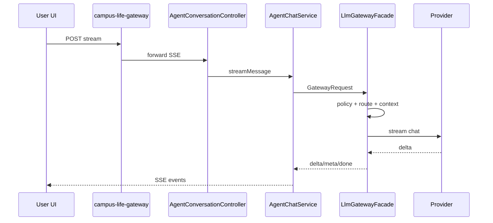
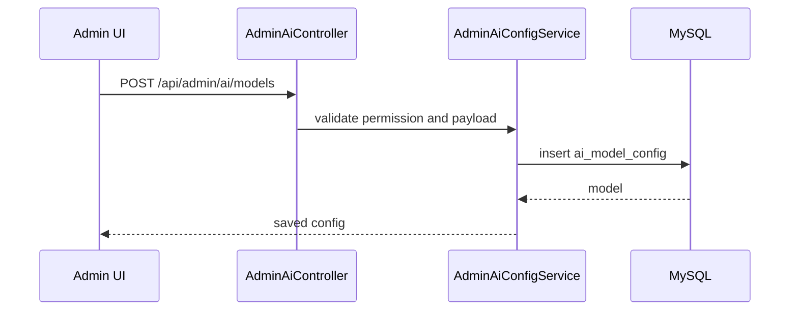

# 大模型网关前后端完整设计方案

本文档面向当前校园生活系统，覆盖 `campus-life-ai` 后端、`campus-life-gateway` 系统网关、`campus-life-frontend` 前端三端改造方案。

## 结论

大模型网关放在 `campus-life-ai` 内部，作为 AI 服务的模型调用治理层；`campus-life-gateway` 只做 HTTP 路由、JWT、粗粒度限流和跨服务转发。

```text
前端
  -> campus-life-gateway
  -> campus-life-ai Controller
  -> AI 业务服务
  -> LlmGatewayFacade
  -> 策略 / 路由 / 上下文 / 执行 / 观测
  -> Provider Adapter
  -> 外部大模型
```

## 设计目标

- 用户侧：稳定的对话、知识库问答、流式输出、引用来源展示、可中断生成。
- 商家侧：商家运营 Agent、商家知识库、运营场景模型隔离。
- 管理端：Provider、模型、场景、路由、限流、配额、日志、成本、健康状态统一管理。
- 后端侧：统一封装供应商协议、路由策略、重试降级、审计日志、指标和安全控制。
- 运维侧：按供应商、模型、场景、用户维度观测成功率、延迟、Token、费用和错误。

## 现状基础

后端已具备：

- `ai_provider_config`：Provider 配置和密钥密文。
- `ai_capability_config`：能力开关、灰度、限流和配额 JSON 预留。
- `ai_scene_config`：场景与 Provider、模型、提示词、超时的映射。
- `ai_call_log`：调用日志和统计基础。
- `LlmProvider`、`ProviderSelector`：模型供应商适配抽象。
- `AiChatRouteResolver`：聊天路由解析。
- `AgentChatService`：会话、消息、RAG、工具、同步和流式对话。

前端已具备：

- 用户端 `AgentChatPage.vue`：快速/流式聊天、知识库模式、停止生成。
- 用户端知识库列表和详情页。
- 商家端 `MerchantAIPage.vue`：商家 AI 入口。
- 管理端 `AdminAI.vue`：Provider、Capability、Scene、Ops、Logs 管理。
- API 封装：`apps/consumer-web/api/agent.ts`、`knowledge.ts`，`apps/admin-web/api/admin.ts`。

## 后端设计

### 1. 包结构

新增包放在：

```text
campus-life-ai/src/main/java/com/campus/campus_life_ai/ai/gateway
```

建议结构：

```text
ai/gateway
  LlmGatewayFacade.java
  DefaultLlmGatewayFacade.java
  dto/
    GatewayRequest.java
    GatewayResponse.java
    GatewayUsage.java
    GatewayError.java
    GatewayStreamConsumer.java
  policy/
    GatewayPolicy.java
    GatewayPolicyChain.java
    RequestShapePolicy.java
    CapabilitySwitchPolicy.java
    RateLimitPolicy.java
    QuotaPolicy.java
    SafetyPolicy.java
  route/
    ModelRoutePlanner.java
    ModelRoute.java
    RouteCandidate.java
    ProviderHealthRegistry.java
  context/
    PromptContextBuilder.java
    SystemPromptResolver.java
    MemoryContextContributor.java
    RagContextContributor.java
    ToolContextContributor.java
  invoke/
    ModelInvocationEngine.java
    RetryPolicy.java
    FallbackPolicy.java
    InvocationResult.java
  observe/
    GatewayCallLogger.java
    GatewayMetricsRecorder.java
```

### 2. 核心职责

`AgentChatService` 继续负责业务语义：

- 创建和读取会话。
- 保存用户消息和助手消息。
- 构造业务上下文，例如知识库选择、用户 ID、会话 ID。
- 组装返回 DTO。

`LlmGatewayFacade` 负责模型调用治理：

- 生成或接收 `requestId`。
- 执行策略链。
- 规划模型路由。
- 构造标准模型命令。
- 调用 Provider。
- 处理重试、降级、超时和错误归一化。
- 记录调用日志和指标。

### 3. 统一请求模型

```java
public class GatewayRequest {
    private String requestId;
    private Long userId;
    private String sessionId;
    private String capabilityCode;
    private String sceneCode;
    private String providerCode;
    private String modelCode;
    private String input;
    private List<ChatCompletionCommand.PromptMessage> messages;
    private String systemPrompt;
    private List<Long> knowledgeBaseIds;
    private Boolean usePersonalKnowledge;
    private Boolean usePlatformKnowledge;
    private Double temperature;
    private Integer maxOutputTokens;
    private Map<String, Object> attributes;
}
```

### 4. 统一响应模型

```java
public class GatewayResponse {
    private String requestId;
    private String content;
    private String providerCode;
    private String modelCode;
    private GatewayUsage usage;
    private String finishReason;
    private Integer latencyMs;
    private List<KnowledgeReferenceDTO> knowledgeReferences;
    private GatewayError error;
}
```

流式事件统一为：

```text
meta   requestId/sessionId/route/knowledgeReferences
delta  content fragment
usage  promptTokens/completionTokens/totalTokens/latencyMs
error  normalized error
done   final response
```

### 5. 策略链

执行顺序：

1. `RequestShapePolicy`：消息非空、最大长度、参数范围。
2. `CapabilitySwitchPolicy`：检查 `ai_capability_config.enabled` 和 `ai_scene_config.enabled`。
3. `RateLimitPolicy`：按用户、角色、场景、Provider 限流。
4. `QuotaPolicy`：按日/月调用次数、Token、费用配额控制。
5. `SafetyPolicy`：根据 `safety_level` 做输入拦截或二次审核。

第一阶段 `RateLimitPolicy` 可用内存实现；生产环境建议改 Redis，和系统网关限流分层：系统网关做请求数限流，AI 网关做 Token/场景/模型配额。

### 6. 路由设计

路由优先级：

```text
可信请求覆盖 providerCode/modelCode
  -> ai_scene_config
  -> ai_gateway_route_rule
  -> ai_provider_config.default_model_code
  -> application.yml/env
```

路由候选要包含：

- `providerCode`
- `modelCode`
- `baseUrl`
- `timeoutMs`
- `temperature`
- `maxOutputTokens`
- `priority`
- `fallbackLevel`
- `estimatedCost`

普通用户不允许覆盖 Provider；管理员和内部服务可以通过权限控制覆盖。

### 7. Provider 适配

短期继续复用现有：

- `LlmProvider`
- `SpringAiOpenAiCompatibleProvider`
- `OpenAiCompatibleProvider`
- `ProviderSelector`

中期拆成：

```text
ChatProvider
StreamChatProvider
EmbeddingProvider
ModerationProvider
RerankProvider
```

这样对话、知识库向量化、内容审核、推荐解释都能走同一个网关治理。

### 8. 数据库扩展

保留现有表，同时新增：

```sql
CREATE TABLE ai_model_config (
    id BIGINT UNSIGNED AUTO_INCREMENT PRIMARY KEY,
    provider_code VARCHAR(32) NOT NULL,
    model_code VARCHAR(64) NOT NULL,
    model_name VARCHAR(128) NOT NULL,
    capabilities JSON NULL,
    context_window INT NULL,
    max_output_tokens INT NULL,
    input_price_per_1k DECIMAL(10, 6) NULL,
    output_price_per_1k DECIMAL(10, 6) NULL,
    enabled TINYINT NOT NULL DEFAULT 1,
    priority INT NOT NULL DEFAULT 100,
    created_at DATETIME NOT NULL DEFAULT CURRENT_TIMESTAMP,
    updated_at DATETIME NOT NULL DEFAULT CURRENT_TIMESTAMP ON UPDATE CURRENT_TIMESTAMP,
    UNIQUE KEY uk_ai_model_provider_code (provider_code, model_code)
) CHARSET = utf8mb4 COMMENT = 'AI 模型配置表';

CREATE TABLE ai_gateway_route_rule (
    id BIGINT UNSIGNED AUTO_INCREMENT PRIMARY KEY,
    rule_name VARCHAR(128) NOT NULL,
    capability_code VARCHAR(32) NOT NULL,
    scene_code VARCHAR(64) NULL,
    match_rule_json JSON NULL,
    route_rule_json JSON NOT NULL,
    enabled TINYINT NOT NULL DEFAULT 1,
    priority INT NOT NULL DEFAULT 100,
    created_at DATETIME NOT NULL DEFAULT CURRENT_TIMESTAMP,
    updated_at DATETIME NOT NULL DEFAULT CURRENT_TIMESTAMP ON UPDATE CURRENT_TIMESTAMP,
    INDEX idx_ai_route_rule_scene (capability_code, scene_code, enabled, priority)
) CHARSET = utf8mb4 COMMENT = 'AI 网关路由规则表';

CREATE TABLE ai_usage_quota (
    id BIGINT UNSIGNED AUTO_INCREMENT PRIMARY KEY,
    subject_type VARCHAR(16) NOT NULL COMMENT 'USER ROLE MERCHANT GLOBAL',
    subject_id VARCHAR(64) NULL,
    capability_code VARCHAR(32) NULL,
    scene_code VARCHAR(64) NULL,
    quota_period VARCHAR(16) NOT NULL COMMENT 'DAY MONTH',
    max_calls INT NULL,
    max_tokens INT NULL,
    max_cost DECIMAL(12, 4) NULL,
    enabled TINYINT NOT NULL DEFAULT 1,
    created_at DATETIME NOT NULL DEFAULT CURRENT_TIMESTAMP,
    updated_at DATETIME NOT NULL DEFAULT CURRENT_TIMESTAMP ON UPDATE CURRENT_TIMESTAMP,
    INDEX idx_ai_quota_subject (subject_type, subject_id, enabled)
) CHARSET = utf8mb4 COMMENT = 'AI 使用配额表';
```

`ai_call_log` 建议扩展：

```sql
ALTER TABLE ai_call_log
    ADD COLUMN fallback_level INT NULL,
    ADD COLUMN prompt_chars INT NULL,
    ADD COLUMN completion_chars INT NULL,
    ADD COLUMN cost_amount DECIMAL(12, 6) NULL,
    ADD COLUMN error_type VARCHAR(32) NULL;
```

### 9. 后端接口设计

用户和商家对话继续使用现有接口：

```text
POST /api/agent/conversations
GET  /api/agent/conversations
GET  /api/agent/conversations/{sessionId}
POST /api/agent/conversations/{sessionId}/messages
POST /api/agent/conversations/{sessionId}/messages/stream
```

管理端保留并扩展：

```text
GET  /api/admin/ai/stats/overview
GET  /api/admin/ai/logs
GET  /api/admin/ai/providers
POST /api/admin/ai/providers
PUT  /api/admin/ai/providers/{id}
GET  /api/admin/ai/capabilities
GET  /api/admin/ai/scenes
```

新增管理接口：

```text
GET  /api/admin/ai/models
POST /api/admin/ai/models
PUT  /api/admin/ai/models/{id}
DELETE /api/admin/ai/models/{id}

GET  /api/admin/ai/route-rules
POST /api/admin/ai/route-rules
PUT  /api/admin/ai/route-rules/{id}
DELETE /api/admin/ai/route-rules/{id}

GET  /api/admin/ai/quotas
POST /api/admin/ai/quotas
PUT  /api/admin/ai/quotas/{id}
DELETE /api/admin/ai/quotas/{id}

POST /api/admin/ai/providers/{id}/health-check
POST /api/admin/ai/gateway/probe
GET  /api/admin/ai/stats/usage-trend
GET  /api/admin/ai/stats/model-ranking
```

内部服务接口仅供可信后端调用：

```text
POST /api/internal/ai/gateway/chat
POST /api/internal/ai/gateway/chat/stream
POST /api/internal/ai/gateway/embedding
POST /api/internal/ai/gateway/moderation
```

内部接口必须增加服务间鉴权，例如内部 Token、网关 Header 或 mTLS，不走普通用户权限。

## 前端设计

### 1. 前端模块边界

当前前端有 `src/views` 共享页面和 `apps/*` 多入口。建议：

```text
campus-life-frontend
  src/views/agent
    AgentChatPage.vue
    KnowledgeBaseListPage.vue
    KnowledgeBaseDetailPage.vue
  src/views/admin
    AdminAI.vue
    AdminAgentHub.vue
    AdminAiModelManage.vue        新增或并入 AdminAI tab
    AdminAiRouteRuleManage.vue    新增或并入 AdminAI tab
    AdminAiQuotaManage.vue        新增或并入 AdminAI tab
  src/views/merchant
    MerchantAIPage.vue
  apps/consumer-web/api
    agent.ts
    knowledge.ts
  apps/admin-web/api
    admin.ts
```

短期建议继续扩展 `AdminAI.vue` 的 tab，避免新增太多页面。中后期当管理端复杂后再拆组件。

### 2. 用户端 Agent 体验

现有 `AgentChatPage.vue` 保留，增强点：

- 展示本次响应的 `providerCode`、`modelCode`、耗时和 Token，用折叠详情展示。
- 展示知识库引用列表，点击可跳到文档详情。
- 流式模式默认开启，失败时自动回退普通请求。
- 停止生成后显示 `CANCELLED` 状态，并调用后端取消接口或记录断连。
- 输入区支持场景选择，但普通用户只看到业务化名称，例如“通用问答”“我的知识库”“平台问答”。

前端 payload 继续使用：

```ts
export interface SendAgentMessagePayload {
  content: string
  sceneCode?: string
  capabilityCode?: string
  providerCode?: string
  modelCode?: string
  knowledgeBaseIds?: number[]
  usePersonalKnowledge?: boolean
  usePlatformKnowledge?: boolean
}
```

普通用户页面不展示 `providerCode` 和 `modelCode` 输入控件，只展示后端返回的实际路由结果。

### 3. 商家端 AI 工作台

`MerchantAIPage.vue` 保留入口卡片，增强：

- 商家运营 Agent 默认使用 `chat.merchant_ops`。
- 商家知识库上传的文档 owner 应为 `MERCHANT` 或当前商家主体，避免和个人知识库混用。
- 商家对话页可增加业务快捷入口：券活动建议、退款处理建议、门店资料优化、违规风险检查。

商家端不允许手动选择模型，只能选择场景和知识库。

### 4. 管理端 AI 管理

当前 `AdminAI.vue` 已有：

- 总览
- Provider
- Capability
- Scene
- Ops
- Logs

建议扩展为：

```text
总览
Provider
模型
Capability
Scene
路由规则
限流配额
调用日志
用量成本
健康诊断
测试台
```

#### Provider 管理

字段：

- Provider 编码、名称、Base URL、API Key、默认模型。
- 连接超时、读取超时。
- 是否启用。
- 健康检查按钮。

API：

```ts
getAdminAiProviders()
createAdminAiProvider()
updateAdminAiProvider()
deleteAdminAiProvider()
checkAdminAiProviderHealth(id)
```

#### 模型管理

字段：

- Provider
- 模型编码
- 模型名称
- 能力：`chat`、`embedding`、`moderation`、`tool_calling`、`vision`
- 上下文窗口
- 最大输出 Token
- 输入/输出单价
- 优先级
- 启用状态

用途：

- 路由规则选择模型。
- 费用统计。
- 禁用故障模型。
- 限制场景选择不支持的模型。

#### Scene 管理

保留现有字段，增强：

- 增加模型下拉，不再手填 `modelCode`。
- 显示该场景命中的路由规则。
- 支持“测试该场景”。
- JSON Schema 编辑增加格式化和校验。

#### 路由规则管理

规则示例：

```json
{
  "match": {
    "role": "MERCHANT",
    "sceneCode": "chat.merchant_ops"
  },
  "route": {
    "candidates": [
      { "providerCode": "openai-compatible", "modelCode": "qwen-plus", "priority": 10 },
      { "providerCode": "openai-compatible", "modelCode": "qwen-turbo", "priority": 20 }
    ],
    "fallbackEnabled": true
  }
}
```

前端提供表单模式和 JSON 模式，初期可以只做 JSON 模式。

#### 限流配额管理

维度：

- 全局
- 角色
- 用户
- 商家
- 场景

配置项：

- 每分钟请求数。
- 每日调用数。
- 每日 Token。
- 每月费用。
- 超限动作：拒绝、降级模型、仅允许非流式。

#### 调用日志

列表字段：

- 时间
- Request ID
- 用户
- 能力/场景
- Provider/模型
- 成功/失败
- Token
- 成本
- 耗时
- fallback 层级
- 错误类型和错误信息

增强交互：

- 按场景、模型、供应商、状态筛选。
- 点击查看请求详情，但敏感 Prompt 和 API Key 不回显。
- 支持导出 CSV。

#### 用量成本

图表：

- 调用量趋势。
- Token 趋势。
- 成本趋势。
- 模型 Top N。
- 失败原因 Top N。
- P95/P99 延迟。

#### 测试台

用途：

- 管理员测试 Provider、模型、场景和路由规则。
- 输入消息、选择场景、选择是否流式。
- 返回实际命中的 Provider、模型、Token、耗时、引用和错误。

接口：

```text
POST /api/admin/ai/gateway/probe
```

### 5. 前端 API 扩展

在 `apps/admin-web/api/admin.ts` 增加：

```ts
export interface AdminAiModelConfig {
  id: number
  providerCode: string
  modelCode: string
  modelName: string
  capabilities?: string[]
  contextWindow?: number
  maxOutputTokens?: number
  inputPricePer1k?: number
  outputPricePer1k?: number
  enabled: boolean
  priority: number
  createdAt?: string
  updatedAt?: string
}

export interface AdminAiRouteRule {
  id: number
  ruleName: string
  capabilityCode: string
  sceneCode?: string
  matchRuleJson?: string
  routeRuleJson: string
  enabled: boolean
  priority: number
  createdAt?: string
  updatedAt?: string
}

export interface AdminAiQuota {
  id: number
  subjectType: 'USER' | 'ROLE' | 'MERCHANT' | 'GLOBAL'
  subjectId?: string
  capabilityCode?: string
  sceneCode?: string
  quotaPeriod: 'DAY' | 'MONTH'
  maxCalls?: number
  maxTokens?: number
  maxCost?: number
  enabled: boolean
}
```

新增函数：

```ts
getAdminAiModels()
createAdminAiModel(payload)
updateAdminAiModel(id, payload)
deleteAdminAiModel(id)

getAdminAiRouteRules()
createAdminAiRouteRule(payload)
updateAdminAiRouteRule(id, payload)
deleteAdminAiRouteRule(id)

getAdminAiQuotas()
createAdminAiQuota(payload)
updateAdminAiQuota(id, payload)
deleteAdminAiQuota(id)

probeAdminAiGateway(payload)
getAdminAiUsageTrend(params)
getAdminAiModelRanking(params)
```

## campus-life-gateway 设计

现有 `campus-life-gateway` 已把这些路径转发到 AI 服务：

```text
/api/agent/**
/api/ai/**
/api/admin/ai/**
/api/merchant/ai/**
```

这里保持不变，只补充：

- 如果新增 `/api/internal/ai/**`，默认不暴露给浏览器。
- 对 `/api/agent/**/stream` 确保网关不缓冲响应，保持 SSE 可用。
- 网关限流只做请求级限流；Token、模型、配额限流放在 `campus-life-ai` 的 LLM 网关内。

## 权限设计

```text
用户端 /api/agent/**：登录用户可用，只能使用已启用场景。
商家端 /api/merchant/ai/**：必须是商家角色。
管理端 /api/admin/ai/**：必须是管理员角色。
内部接口 /api/internal/ai/**：服务间鉴权，不允许浏览器直接访问。
```

敏感信息规则：

- API Key 只写入，不回显。
- 调用日志不展示完整密钥、Authorization Header。
- Prompt 详情默认脱敏，管理员按需查看摘要。
- 普通用户不可指定 Provider，不可选择未启用模型。

## 可观测设计

Micrometer 指标：

```text
ai_gateway_requests_total{provider,model,scene,status}
ai_gateway_latency_ms{provider,model,scene}
ai_gateway_tokens_total{provider,model,scene,type}
ai_gateway_cost_total{provider,model,scene}
ai_gateway_fallback_total{from_model,to_model,reason}
ai_gateway_errors_total{provider,model,error_type}
```

日志字段：

```text
requestId
userId
sessionId
capabilityCode
sceneCode
providerCode
modelCode
latencyMs
promptTokens
completionTokens
totalTokens
costAmount
success
errorType
errorCode
fallbackLevel
```

## 核心流程

### 用户流式对话



### 管理端新增模型



## 分阶段落地

### 阶段一：后端网关骨架

- 新增 `LlmGatewayFacade`、DTO、`ModelInvocationEngine`。
- `AgentChatService` 改为调用 `LlmGatewayFacade`。
- 日志写入从 `AgentChatService` 下沉到 `GatewayCallLogger`。
- 行为保持兼容，前端无需改动。

### 阶段二：管理端增强

- 新增 `ai_model_config`、`ai_gateway_route_rule`。
- 管理端 `AdminAI.vue` 增加“模型”“路由规则”“测试台”tab。
- API 增加模型和路由规则 CRUD。

### 阶段三：限流、配额和成本

- 新增 `ai_usage_quota`。
- 实现 `RateLimitPolicy`、`QuotaPolicy`。
- 调用日志增加成本字段。
- 管理端增加“限流配额”“用量成本”tab。

### 阶段四：多能力统一网关

- embedding、moderation、generation 接入统一网关。
- 知识库向量化走 `EmbeddingProvider`。
- 发帖审核走 `ModerationProvider`。
- 内容生成、推荐解释走 `ChatProvider` 或 `GenerationProvider`。

## 最小可交付范围

第一版建议只交付：

- 后端 `LlmGatewayFacade` 骨架。
- 同步和流式聊天都从网关发起。
- 管理端新增模型管理 tab。
- 调用日志补充 `errorType`、`fallbackLevel`。
- 测试台支持管理员用场景发起一次探测调用。

这样改动范围可控，但后续 Provider 扩展、模型路由、成本统计都有稳定位置。

