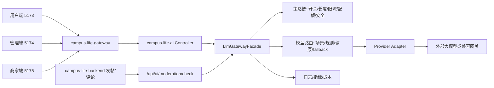

# 大模型网关全阶段整理

本文档整理阶段 0 到阶段 9 的实际落地结果，作为后续开发、联调、验收和运维的入口文档。

## 当前结论

大模型网关放在 `campus-life-ai` 内部，作为 AI 服务的模型调用治理层。`campus-life-gateway` 仍只负责 HTTP 转发、认证透传和粗粒度流量入口，业务服务不直接调用具体模型供应商。



固定前端开发端口如下：

| 入口 | 命令 | 地址 |
| --- | --- | --- |
| 用户端 | `npm run dev` 或 `npm run dev:consumer` | `http://localhost:5173/` |
| 管理端 | `npm run dev:admin` | `http://localhost:5174/` |
| 商家端 | `npm run dev:merchant` | `http://localhost:5175/` |

管理端 AI 页面是 `http://localhost:5174/admin/ai`，不是用户端 `5173`。

## 阶段状态

| 阶段 | 主题 | 当前状态 | 主要交付 |
| --- | --- | --- | --- |
| 0 | 架构边界和落点 | 已完成 | 明确网关放在 `campus-life-ai`；整理前后端职责、系统网关职责、端口边界。 |
| 1 | 后端网关骨架 | 已完成 | 新增 `ai.gateway` 包、`LlmGatewayFacade`、统一请求/响应/用量/错误模型；聊天同步和流式调用收敛到网关。 |
| 2 | 模型和路由治理 | 已完成 | 新增 `ai_model_config`、`ai_gateway_route_rule`；实现 `ModelRoutePlanner`、候选路由、fallback、Provider 健康状态。 |
| 3 | 管理端配置闭环 | 已完成 | 管理端支持 Provider、模型、Capability、Scene、路由规则、日志和统计相关 API 与 UI。 |
| 4 | 观测和运维基础 | 已完成 | 网关统一记录调用日志、错误类型、延迟、Token、fallback；接入指标记录和运维分析入口。 |
| 5 | 限流、配额和成本 | 已完成 | 新增 `ai_usage_quota`；实现 `RateLimitPolicy`、`QuotaPolicy`、`GatewayCostCalculator`；管理端增加配额和成本视图。 |
| 6 | 测试台和健康检查 | 已完成 | 管理端支持 Provider 健康检查和 `/api/admin/ai/gateway/probe` 测试台，可验证实际路由、模型和响应。 |
| 7 | 安全治理 | 已完成 | 新增 `ai_gateway_safety_rule`；实现输入/输出安全规则、关键字/正则匹配、阻断和审计动作。 |
| 8 | 审核能力接入网关 | 已完成 | `/api/ai/moderation/check` 接入 `moderation.text_post` 场景，模型返回 `PASS/REJECT/REVIEW` 审核结果。 |
| 9 | 业务发布闭环 | 已完成 | `campus-life-backend` 发帖、编辑帖子、发表评论前调用 AI 审核；拒绝内容阻断发布，AI 异常默认 fail-open。 |

## 代码落点

### AI 服务

核心包：

- `src/main/java/com/campus/campus_life_ai/ai/gateway`
- `src/main/java/com/campus/campus_life_ai/ai/gateway/policy`
- `src/main/java/com/campus/campus_life_ai/ai/gateway/route`
- `src/main/java/com/campus/campus_life_ai/ai/gateway/observe`

关键服务：

- `LlmGatewayFacade`：统一网关入口。
- `DefaultLlmGatewayFacade`：策略、路由、调用、fallback、日志和指标编排。
- `ModelRoutePlanner`：根据场景、规则、模型配置和健康状态规划候选模型。
- `GatewayPolicyChain`：统一执行请求形状、开关、限流、配额、安全策略。
- `GatewayCallLogger`：统一写入 `ai_call_log`。
- `GatewayMetricsRecorder`：统一输出 Micrometer 指标。
- `ModerationGatewayService`：内容审核能力接入网关。
- `AdminAiGatewayProbeService`：管理端测试台和 Provider 健康检查。

数据库迁移：

- `V5__gateway_models_and_routes.sql`：模型配置和路由规则。
- `V6__gateway_quotas_and_costs.sql`：配额表和调用日志成本字段。
- `V7__gateway_safety_rules.sql`：安全治理规则。
- `V8__enable_moderation_gateway.sql`：启用文本审核场景。

管理端接口：

- `GET/POST/PUT/DELETE /api/admin/ai/models`
- `GET/POST/PUT/DELETE /api/admin/ai/route-rules`
- `GET/POST/PUT/DELETE /api/admin/ai/safety-rules`
- `GET/POST/PUT/DELETE /api/admin/ai/quotas`
- `POST /api/admin/ai/providers/{id}/health-check`
- `POST /api/admin/ai/gateway/probe`
- `GET /api/admin/ai/stats/usage-trend`
- `GET /api/admin/ai/stats/model-ranking`
- `POST /api/ai/moderation/check`

### 前端

管理端 API：

- `apps/admin-web/api/admin.ts`

管理端页面：

- `src/views/admin/AdminAI.vue`

当前管理端 AI 页面覆盖：

- 总览
- Provider
- 模型
- Capability
- Scene
- 路由规则
- 安全规则
- 限流配额
- 调用日志
- 用量成本
- 健康诊断
- 测试台
- 文本审核

### 业务后端

审核客户端：

- `campus-life-backend/src/main/java/com/campus/campus_life_backend/modules/forum/service/AiContentModerationService.java`
- `campus-life-backend/src/main/java/com/campus/campus_life_backend/modules/forum/config/AiModerationProperties.java`

接入点：

- `PostService.createPost`
- `PostService.updatePost`
- `CommentService.createComment`

业务行为：

- `PASS`：允许发布。
- `REJECT`：阻断发布，错误信息透传到前端提示。
- `REVIEW`：默认允许发布；设置 `AI_MODERATION_BLOCK_REVIEW=true` 后阻断。
- AI 审核服务不可用：默认 fail-open；设置 `AI_MODERATION_FAIL_OPEN=false` 后失败关闭。

## 关键配置

### AI 服务

```text
AI_GATEWAY_ENABLED=true
AI_GATEWAY_MAX_INPUT_CHARS=32000
AI_GATEWAY_HEALTH_FAILURE_THRESHOLD=2
AI_GATEWAY_HEALTH_COOLDOWN_MS=30000
AI_DEFAULT_PROVIDER_CODE=openai-compatible
AI_DEFAULT_MODEL_CODE=<默认模型>
AI_OPENAI_COMPATIBLE_BASE_URL=<供应商兼容地址>
AI_OPENAI_COMPATIBLE_API_KEY=<供应商 API Key>
AI_OPENAI_COMPATIBLE_MODEL=<默认模型>
```

### 业务后端审核

```text
AI_MODERATION_ENABLED=true
AI_SERVICE_BASE_URL=http://127.0.0.1:8083
AI_MODERATION_FAIL_OPEN=true
AI_MODERATION_BLOCK_REVIEW=false
```

业务后端调用 AI 服务时会透传当前用户的 `Authorization`，因此 `JWT_SECRET` 需要和 AI 服务一致。生产环境如果改成内部服务接口，应补充服务间鉴权。

## 验收记录

已完成的关键验证：

- `campus-life-ai` 网关相关单测和全量测试通过。
- `campus-life-frontend` 管理端构建 `npm run build:admin` 通过。
- `campus-life-backend` 定向测试 `AiContentModerationServiceTest,PostControllerSecurityTest` 通过。
- `campus-life-backend` 全量 `mvn test` 通过：92 tests，1 skipped。
- 管理端地址 `http://localhost:5174/admin/ai` 已通过浏览器验证会按登录态跳转到 `/login`。

常用回归命令：

```powershell
mvn -f D:\code1\code\campus-life-ai\pom.xml "-Dmaven.repo.local=D:/code1/code/campus-life-backend/target/.m2repo" test
mvn -f D:\code1\code\campus-life-backend\pom.xml "-Dmaven.repo.local=D:/code1/code/campus-life-backend/target/.m2repo" test
npm --prefix D:\code1\code\campus-life-frontend run build:admin
```

## 运维使用顺序

1. 在 Provider 中配置供应商、Base URL、API Key 和默认模型。
2. 在模型管理中维护可用模型、能力、上下文窗口、输出上限和单价。
3. 在 Capability 和 Scene 中启用业务能力与场景。
4. 按需配置路由规则，设置主模型和 fallback 候选。
5. 配置安全规则，先低优先级观察，再开启阻断。
6. 配置限流配额，先全局维度，再细化到用户、角色或场景。
7. 使用健康检查确认 Provider 可用。
8. 使用测试台验证实际命中模型和返回内容。
9. 查看调用日志、用量趋势、模型排行和错误类型。
10. 业务侧开启审核闭环，观察 `REJECT/REVIEW` 比例和 fail-open 日志。

## 后续建议

- 集群部署时把内存限流迁移到 Redis，避免多实例配额窗口不一致。
- 对业务后端到 AI 服务的审核调用增加服务间鉴权，减少仅依赖用户 JWT 的耦合。
- 为流式调用补充客户端断连后的取消状态落库。
- 将审核能力从文本扩展到图片和多模态内容。
- 将商家运营生成、推荐解释、客服场景继续接入同一套网关治理。
